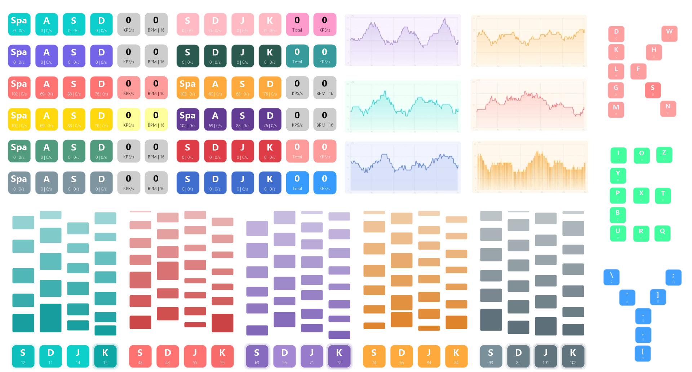
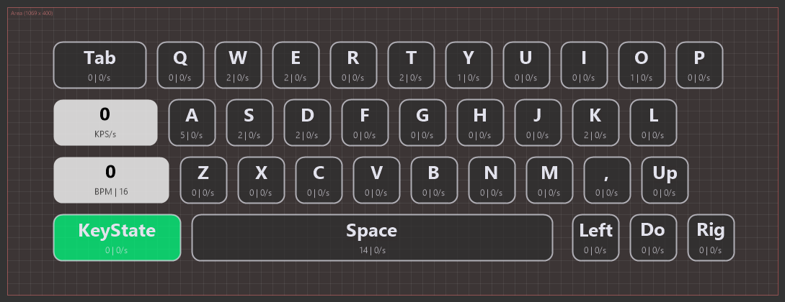
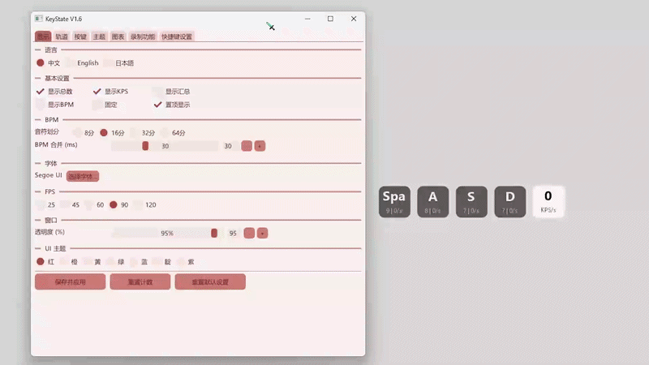

# KeyState V1.6

> Lightweight Windows real-time keyboard state overlay monitor





---

## Introduction

**KeyState** is a Windows desktop overlay tool that creates a **translucent floating window** on your screen, displaying monitored keys' **press/release status**, **total press count (Total)**, **keys per second (KPS)**, and **BPM rhythm analysis**.

Suitable for game streaming, key teaching, input method testing, keyboard showcases, rhythm game analysis, and more.

---

## Interface Preview

### State Floating Window

- **Transparent background**, floats anywhere without blocking desktop content
- Key mapping boxes arranged in **horizontal rows**
- **Smoothstep color easing + multi-layer glow animation** on press
- Real-time Total count and KPS rate display
- **Mouse drag** to reposition, auto-saves on release

```
+-------+ +-----+ +-----+ +-----+ +------+ +------+
| Space | |  A  | |  S  | |  D  | |  S   | |  B   |
| 5|2s  | |3|1s | |8|4s | |1|0s | |17|7/s| |90|16 |
+-------+ +-----+ +-----+ +-----+ +------+ +------+
                                   S=Total  B=BPM
```

### Settings Panel

| Section | Features |
|---------|----------|
| **Language** | Chinese / English / Japanese |
| **Basic Settings** | Show Total / Show KPS / Show Summary / Show History / Show BPM / Click Through / Always on Top / UI Theme (白绿/黑紫/蓝白/橙黑) |
| **Layout** | Key Spacing (0-40px) + Border Width (0-8px) + Overlay Opacity |
| **Track** | Track Height (20-600px) + Grow Speed + Float Speed + Block Max% + Track Gap + Background Alpha + Block Alpha + Border Lines toggle |
| **Visual** | 16 theme presets (Custom + 15 built-in) + Font selector |
| **Key Mapping** | Press any key / mouse button to capture and add / Delete (at least 1 required); 5-layer key name fallback |
| **Appearance (per-key)** | Custom label, width & height (64x64 default), font color / normal bg / press bg / **border color** |
| **BPM** | Note division (8th/16th/32nd/64th) + Merge window (0-100ms) |
| **Summary Box Colors + Size** | Independent background & text colors + custom width & height for Total / KPS / BPM boxes |
| **Chart** | Show / Hide + Grid lines + Time range (1-30s) + Width/Height + Margins + Rounded corners + BG/Line colors + Type (line/scatter/bar) + Gradient fill |
| **Chart Snap** | Snap below key display with adjustable X/Y offset |
| **Free Mode** | Freely draggable keys + Configurable area (W x H) + Grid Snap (default on, tied to boundary) + Grid size (4-64px) |
| **Recording** | Start/stop via hotkey + **live timer & status indicator** + **customizable output directory** |
| **Hotkey Settings** | In-settings tab to view & modify all 7 global hotkeys |
| **Render FPS** | 25 / 45 / 60 / 90 / 120 FPS |

---

## Controls

| Action | Description |
|--------|-------------|
| **Drag floating window** | Hold and drag the State window freely, auto-saves on release |
| **Right-click window / tray** | Popup menu: Settings / Exit |
| **Ctrl+Shift+K** | Global hotkey to open settings panel |
| **Ctrl+Shift+T** | Global hotkey to open theme editor |
| **Ctrl+Shift+M** | Global hotkey to toggle key mapping overlay show/hide |
| **Ctrl+Shift+N** | Global hotkey to cycle to **next** theme preset |
| **Ctrl+Shift+P** | Global hotkey to cycle to **previous** theme preset |
| **Ctrl+Shift+H** | Global hotkey to toggle history track display |
| **Ctrl+Shift+U** | Global hotkey to toggle KPS chart display |
| **Settings panel → 快捷键设置 tab** | View & modify all global hotkeys directly in-settings |
| **Recording tab** | Live timer, blinking status indicator, customizable output directory |

---

## Advanced Features

### History Track

Each key has a vertical transparent track above it. When pressed, a **block grows from the bottom in real time**; when released, it is cut off and floats upward at a constant speed before fading out. Block width matches the key box, height = press duration x grow speed.

### KPS Real-time Line Chart

An independent transparent overlay window showing real-time KPS trend:
- Dynamic Y-axis that smoothly scales with peak values
- Configurable time range (1~30 seconds), grid lines, and rounded corners
- Customizable background/line colors, margins, and dimensions
- Current value label at the rightmost point
- **Snap mode**: attach below the key display with adjustable X/Y offset

### BPM Rhythm Analysis

An independent BPM box displayed next to the summary box:
- Total KPS x 240 / note division = equivalent BPM
- Selectable note division: 8th / 16th / 32nd / 64th
- BPM merge window (0~100ms) deduplicates simultaneous presses for more accurate calculation

### Theme System

- **16 theme presets** (Custom + 15 built-in) with individual font/normal/press/chart colors
- **Theme Editor** (Ctrl+Shift+T): independent dialog to freely edit any preset's name and colors
- Presets saved to a separate `KeyStateThemes.json` file
- Each preset defines: font color, normal background, press background, chart background, chart line color

| Sample | Style |
|--------|-------|
| Custom | Manual color picker |
| Neon | Pink-purple text + dark purple background + bright pink press |
| Minimal | Dark gray text + light gray background + medium gray press |
| Forest | Light green text + dark green background + bright green press |

---

## Configuration Files

- `KeyStateSetting.json` -- main config: key list, colors, position, size, display options, language, FPS, chart settings, etc.
- `KeyStateThemes.json` -- theme presets database (15 built-in presets)
- Location: Same directory as `KeyState.exe`
- Automatically created with defaults on first run
- Any setting change is **auto-saved instantly** and persists across restarts

---

## Tech Stack

| Component | Details |
|-----------|---------|
| Language | C++17 |
| Rendering | GDI+ (anti-aliased vector graphics + text + premultiplied alpha) |
| Window | Win32 API (WS_EX_LAYERED per-pixel transparency + WS_VSCROLL) |
| Keyboard | WH_KEYBOARD_LL global hook (with IME virtual key filtering) |
| Mouse    | WH_MOUSE_LL global hook (Left / Middle / Right buttons) |
| Config | Custom JSON parser |
| i18n | Chinese / English / Japanese string tables |

## Source Files

```
src/
+-- main.cpp          # Entry point, message pump, tray, hotkeys, recording logic
+-- config.h/cpp      # Config struct + JSON read/write + theme presets
+-- keyboard.h/cpp    # Keyboard hook, state management, KPS, duration tracking
+-- renderer.h/cpp    # GDI+ rendering, easing animation, track, summary, BPM
+-- display_ui.h/cpp  # State transparent overlay, drag
+-- chart_ui.h/cpp    # KPS real-time line chart overlay
+-- settings_ui.h/cpp # Settings panel, color picker, Theme, scroll, hotkeys tab, recording UI
+-- theme_editor.h/cpp# Theme preset editor dialog
+-- lang.h/cpp        # Multi-language string table
+-- imgui_setup.h/cpp # ImGui context init/shutdown, UI theme switching (4 themes)
```

---

## Version History

### V1.6 (2026-07)

- Added: **Track reversal** — optional downward-growing history track with blocks sinking instead of floating up
- Added: **Key border color** — per-key customizable border color independent from font color
- Added: **Rainbow UI themes** — 7 color themes (🔴Red/🟠Orange/🟡Yellow/🟢Green/🔵Blue/🟣Indigo/🟤Purple) switchable instantly in Basic Settings, persists across restarts
- Added: **Recording enhancements** — live elapsed timer, blinking green recording indicator, customizable output directory via folder picker dialog
- Added: **Hotkey Settings tab** — all 7 global hotkeys now configurable directly in-settings tab, removed standalone popup dialog
- Added: **Full multi-language support** — all UI labels, tooltips, and button texts now translate with language switching
- Added: **ImGui setup module** — refactored ImGui init/theme into `imgui_setup.h/cpp` for cleaner code separation
- Changed: **Free Mode grid snap is always enabled** — removed non-grid placement option; hiding boundary now auto-enables click-through to lock layout
- Changed: **Settings window** — no title bar, no resize handle, fixed size, outer window matches content area
- Improved: **Track grow & float speed upper limit raised to 900 px/s** for faster visual feedback
- Improved: **Settings UI layout optimization** — better grouping and more intuitive controls
- Fixed: JSON config saving bug (duplicate `customH` field)
- Fixed: Hotkey settings text flickering due to buffer conflict
- Cleanup: Removed stale build error logs, duplicate favicon, and orphaned `hotkey_ui` source files

### V1.5 (2026-06)

- Added: **Mouse button support** — left / middle / right mouse buttons can now be added as key mappings
  - Captured by clicking the mouse button during "Add Key"
  - Full customization: label, colors, width/height, KPS/Total stats
  - Uses `WH_MOUSE_LL` global hook alongside existing keyboard hook
- Added: **Per-key custom labeling** — each key mapping's display name can be freely edited
  - Configured in Settings → Key Mappings → select a key → edit the Name field
  - List and overlay update in real time
- Added: **Per-key custom width & height** (default 64x64)
  - Configured in Settings → Key Mappings → select a key → Width/Height fields
  - Works in both Normal Mode and Free Mode
  - **Regular mode**: keys auto-arrange by actual width to avoid overlap; window height auto-expands for taller keys
  - **Global key size slider removed** — each key is sized individually
- Added: **Total / KPS / BPM box custom width & height** (default 64x64)
  - Configured in Settings → Box Colors section → W:/H: fields for each box
  - Works in both Normal Mode and Free Mode
- Added: **Free Mode grid snap** — dragging elements snaps to a configurable grid
  - **Enabled by default**, toggle in Settings → Free Mode → Grid Snap
  - Grid size adjustable (4~64px) with a slider
  - Visual grid lines drawn when boundary is visible
  - **Hide boundary = lock layout**: toggling off "Show Boundary" hides boundary lines AND grid, disables snapping — fixing the current layout

### V1.4 (2026-06)

- Added: **5 new global hotkeys**
  - **Ctrl+Shift+M** — Toggle key mapping overlay show/hide
  - **Ctrl+Shift+N** — Cycle to next theme preset
  - **Ctrl+Shift+P** — Cycle to previous theme preset
  - **Ctrl+Shift+H** — Toggle history track display
  - **Ctrl+Shift+U** — Toggle KPS chart display
- Added: **Hotkey Editor** — new button at the bottom of Settings panel opens a dedicated dialog to view and modify all 7 global hotkeys in real time

### V1.3 (2026-06)

- Added: **Chart type switching** — line / scatter / bar chart
- Added: **Gradient fill** for chart area (line fill & bar gradient)
- Added: **Free Mode** — freely draggable key mappings within a configurable area
- Added: **Recording feature** — set a hotkey to start/stop recording; saves per-second KPS/total data as JSON
- Fixed: KPS now displays as integer only (removed decimal part)
- Changed: Total / KPS / BPM box default colors — black font, white background

### V1.2 (2026-06)

- Added: Font selection dialog — supports any installed system font
- Added: Always on top toggle
- Improved: 500ms auto-re-raise to resist fullscreen app occlusion

### V1.1 (2026-06)

- Fixed: Chart settings resetting on every startup
- Fixed: Chart window not closing when resetting to defaults
- Fixed: Key mappings shifting when track is enabled
- Added: Chart snap feature -- snap below key display with adjustable X/Y offset
- Improved: Basic settings layout for clearer grouping

### V1.0 (2026-06)

- Translucent floating State window + full Settings panel (with scrollbar)
- Real-time Total count + KPS sliding window calculation
- Smoothstep color easing animation (80ms press / 100ms release)
- Multi-layer glow press feedback
- 5-layer key name resolution fallback + IME virtual key filtering
- Key history track (real-time growth + constant speed float)
- BPM / note division rhythm calculation
- Sigma summary box + Beta BPM box
- 4 Theme presets + border width + opacity
- Chinese / English / Japanese multi-language support
- Adjustable render FPS (45/60/90/120)
- JSON config persistence in exe directory
- Drag-to-position memory
- System tray + global hotkeys
- At least 1 key mapping boundary protection
- Long-press repeat filtering

---

## Open Source License

This project is licensed under the **MIT License**.

```
MIT License

Copyright (c) 2026 KeyState

Permission is hereby granted, free of charge, to any person obtaining a copy
of this software and associated documentation files (the "Software"), to deal
in the Software without restriction, including without limitation the rights
to use, copy, modify, merge, publish, distribute, sublicense, and/or sell
copies of the Software, and to permit persons to whom the Software is
furnished to do so, subject to the following conditions:

The above copyright notice and this permission notice shall be included in all
copies or substantial portions of the Software.

THE SOFTWARE IS PROVIDED "AS IS", WITHOUT WARRANTY OF ANY KIND, EXPRESS OR
IMPLIED, INCLUDING BUT NOT LIMITED TO THE WARRANTIES OF MERCHANTABILITY,
FITNESS FOR A PARTICULAR PURPOSE AND NONINFRINGEMENT. IN NO EVENT SHALL THE
AUTHORS OR COPYRIGHT HOLDERS BE LIABLE FOR ANY CLAIM, DAMAGES OR OTHER
LIABILITY, WHETHER IN AN ACTION OF CONTRACT, TORT OR OTHERWISE, ARISING FROM,
OUT OF OR IN CONNECTION WITH THE SOFTWARE OR THE USE OR OTHER DEALINGS IN THE
SOFTWARE.
```

> Commercial use is permitted. You are free to use, modify, and distribute this software, including for commercial projects, without any fee. Simply retain the original copyright notice.
